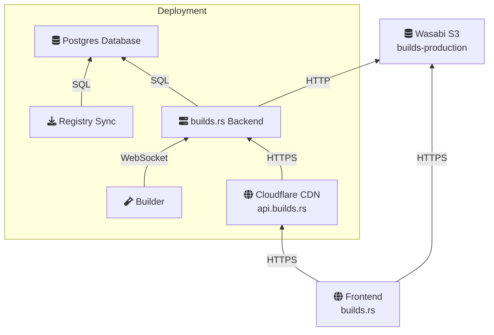

# builds.rs

Project to provide builds for all binary crates on [crates.io]().

The goal for this project is to make it easy to use Rust tools and applications
in the field by providing a convenient service to build binaries for multiple
platforms and architectures. The entire stack itself is written in Rust and is
open source to encourage contribution.

## Architecture

- It is mostly monolithic and has one central backend component. This component
  schedules crates being built and offere the APIs for this and the frontend.
  It may be replicated as needed.
- Uses a Postgres database to store metadata. This is relatively low-traffic,
  as it is only written to when crates are published or builds are started or
  finished. We expect less than 5 transactions per second.
- The registry sync component continuously monitors the [crates.io
  index](https://github.com/rust-lang/crates.io-index) and communicates changes
to the backend via a simple HTTP REST API.
  This is an external service because it only needs to run once.
- The builder is a component that fetches jobs from the backend, builds them
  using Docker, and pushes the resulting binaries back into the backend. This
  can be replicated as needed for parallel building.
- Storage is being handled by a public Wasabi bucket.
- We are considering adding search to this using Meilisearch or Qdrant.

## Development

Prerequisites:

- [rustup](https://rustup.rs/)
- [just](https://github.com/casey/just)
- [trunk](https://trunkrs.dev/)
- [docker](https://docs.docker.com/engine/install/)

Tests:

    just database
    just migrate
    just test

For more information, check the `README.md` files in the respective subcrates.

## License

[MIT](LICENSE.md).
