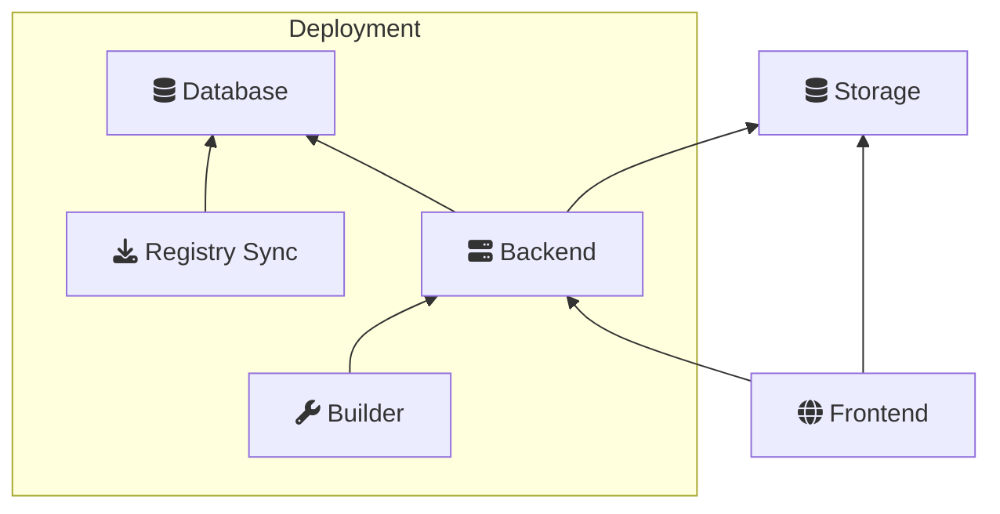
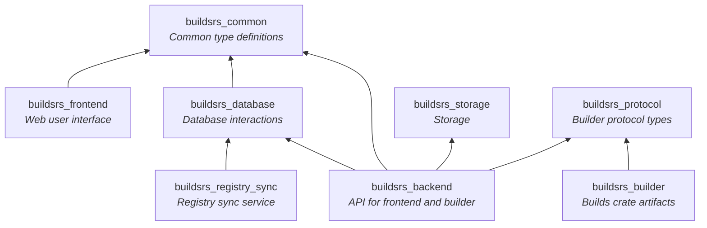

# Components

This chapter explores the architecture of this project both in terms of deployed services
as well as in terms of crates.

## Services

This project uses a microservices architecture. Every component that needs deployment
is built into a Docker container in the CI, and then deployed on a cluster. There are
only two components that are persistent: storage and the database. The storage component
is usually any S3-compatible storage provider, and the database is typically a Postgres
database.

## Crates

Code-wise, this project is a Cargo workspace with multiple crates. Every target
that needs to be built is it's own crate. In addition to that, any code that
needs to be used from multiple target crates is split out into it's own crate.

The next chapters will deal with each of these components, explaining what they do
and how they are related to the other components.

