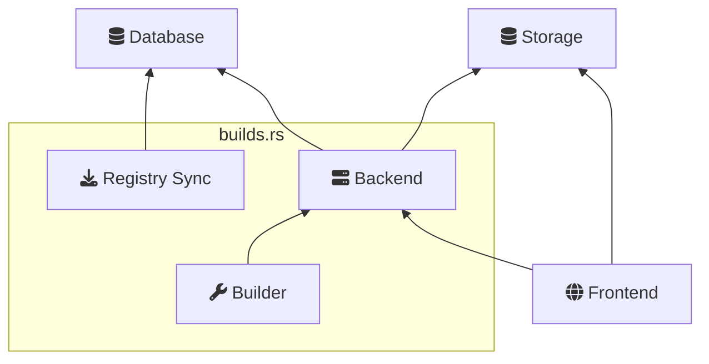
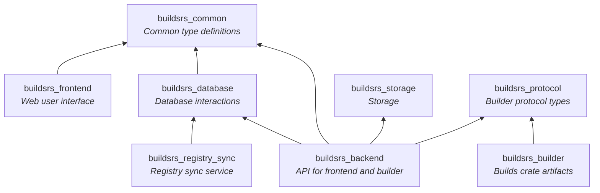

# Components

This chapter explores the architecture of this project both in terms of
deployed services as well as in terms of crates.

## Services

This project uses somewhat of a [microservice][] architecture, although one
could argue that since most of the action happens in the single backend
component, it is more of a monolith. 

Every component that needs deployment is built into a Docker container in the
CI, and then deployed on a cluster. 

There are only two components that are external and persistent: storage and the
database. These are abstracted away in the code. The storage component is
usually any S3-compatible storage provider, and the database is typically a
Postgres database.

## Crates

Code-wise, this project is a [Cargo workspace][workspace] with multiple crates.
Every target that needs to be built is it's own crate. In addition to that, any
code that needs to be used from multiple target crates is split out into it's
own crate.

The next chapters will deal with each of these components, explaining what they
do and how they are related to the other components.

[workspace]: https://doc.rust-lang.org/cargo/reference/workspaces.html
[microservice]: https://martinfowler.com/articles/microservices.html
