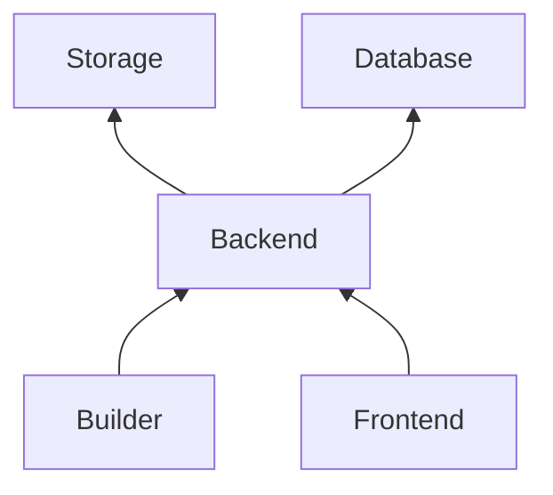
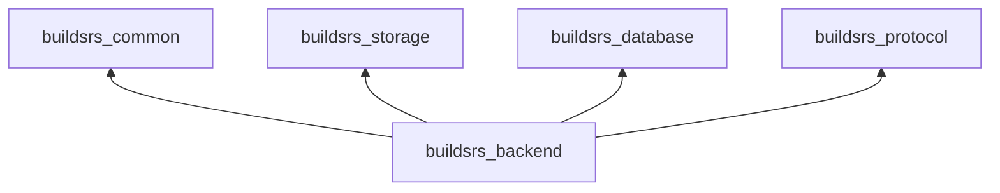

# Backend

The backend is responsible for offering two APIs: the public REST API that the
frontend uses to fetch metadata, such as which crates and versions exist and
which artifacts have been built. The second API is for the builder instances
to connect and fetch build jobs, consisting of a WebSocket and a REST API for
uploading artifacts. This component tracks the number of downloads for each crate
and periodically writes this data to the database.

## Services

The backend uses the storage service to store crate artifacts, and the database to
store metadata (crates, versions, artifacts, builders, build logs, jobs).

It offers a REST API that exposes all of the metadata and artifacts. This API
is consumed by the frontend, and external tools. It also offers a WebSocket,
which is used by the builders to connect to the backend, receive jobs and
stream logs.

## Crates

The backend is implemented in the [buildsrs_backend][] crate. It uses the
[buildsrs_common][] crate for common type definitions. It uses the
[buildsrs_database][] and [buildsrs_storage][] crates to connect to those
respective services. It uses the [buildsrs_protocol][] crate to implement the
builder websocket protocol.

[buildsrs_backend]: /rustdoc/buildsrs_backend
[buildsrs_common]: /rustdoc/buildsrs_common
[buildsrs_protocol]: /rustdoc/buildsrs_protocol
[buildsrs_storage]: /rustdoc/buildsrs_storage
[buildsrs_database]: /rustdoc/buildsrs_database
