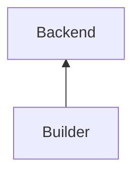
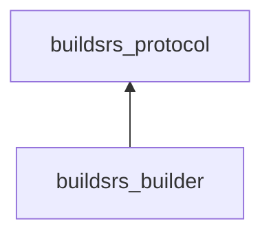

# Builder

The builder is a component that fetches jobs from the backend, builds them
using [Docker][docker], and pushes the resulting binaries back into the
backend. This can be replicated as needed for parallel building.

## Services

The builder connects to the backend using a WebSocket. This is the only service
dependency it has.

## Crates

The builder is implemented in the [buildsrs_builder][] crate. It depends on
the [buildsrs_protocol][] crate, which defines the protocol it uses to interact
with the backend.

[docker]: https://docs.docker.com/engine/install/
[buildsrs_protocol]: /rustdoc/buildsrs_protocol
[buildsrs_builder]: /rustdoc/buildsrs_builder
