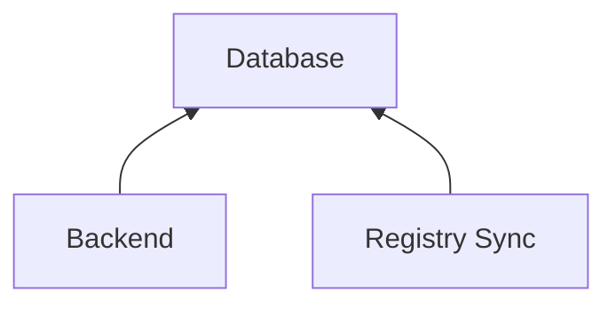
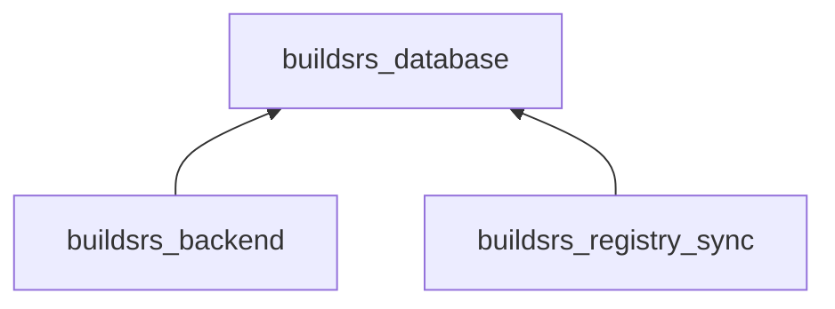

# Database

Uses a [Postgres][postgres] database to store metadata. This includes a list of
crates and crate versions that is synced to the list of crates on [crates.io]
using the Registry Sync service, a list of registered Builders, a list of
current or previous jobs and a list of artifacts for every crate version.

These are the tables that the database currently stores:

| Name | Description |
| ---- | ---- |
| `pubkeys` | Public keys |
| `pubkey_fingerprints` | Public key fingerprints |
| `builders` | Builders that are registered with the backend. |
| `targets` | Targets that can be built. |
| `builder_targets` | Targets that are enabled per builder. |
| `crates` | Crates (synced from [crates.io]) |
| `crate_versions` | Crate versions (synced from [crates.io]) |
| `job_stages` | Job stages |
| `jobs` | Jobs |
| `job_logs` | Job log entries |
| `job_artifacts` | Job artifacts |
| `job_artifact_downloads` | Daily download counts for artifacts |

## Interactions

There are two services that connect to the database: the backend and the
registry sync service.

## Dependencies

All database interactions are implemented in the [buildsrs_database][] crate.

## Features

| Name | Description |
| --- | --- |
| `migrations` | Enables migrations |
| `cli` | Enables database CLI |
| `temp` | Creation of temporary databases, used for testing |
| `options` | Command-line options parsing for database connection |

[postgres]: https://www.postgresql.org/
[crates.io index]: https://github.com/rust-lang/crates.io-index
[crates.io]: https://crates.io/
[buildsrs_database]: /rustdoc/buildsrs_database
