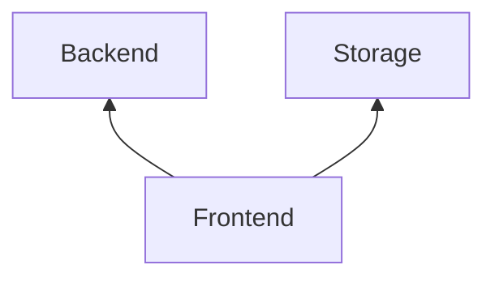
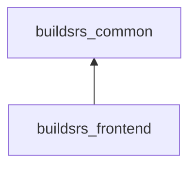

# Frontend

The frontend is a Rust WebAssembly application written using the [Yew][yew]
framework. It is deployed as the main website for [builds.rs][]. It talks to
the backend using a REST API, and offers capabilities to search and explore
crates, versions and artifacts for each.  Styling is done using [Tailwind
CSS][tailwind]. 

## Crates

The frontend mainly needs to interact with the backend's REST API. For artifact downloads,
they may be performed directly from the storage service using a redirect from the backend.
The frontend may also receive the ability to do server-side rendering at some point.

## Crates

The frontend is implemented in the [buildsrs_frontend][] crate. It uses the
[buildsrs_common][] crate for shared data types between it and the backend.

[builds.rs]: https://builds.rs
[yew]: https://yew.rs
[tailwind]: https://tailwindcss.com/
[buildsrs_frontend]: /rustdoc/buildsrs_frontend
[buildsrs_common]: /rustdoc/buildsrs_frontend
