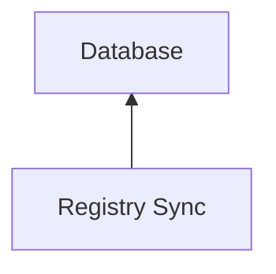
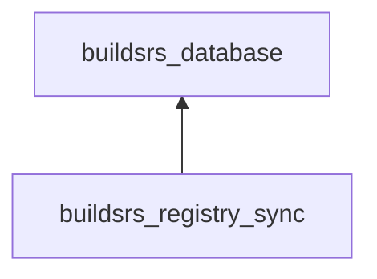

# Registry Sync

The registry sync components keeps the system in sync with the list of crates
published on [crates.io][]. To do this, it polls the [crates.io
index][crates.io index] and inserts any changes into the database directly.

## Services

The Registry Sync service connects directly to the database to keep it in sync.
It has no other dependencies.

## Crates

It is implemented in the [buildsrs_registry_sync][] crate. It depends on the
[buildsrs_database][] crate for database interactions.

[crates.io index]: https://github.com/rust-lang/crates.io-index
[crates.io]: https://crates.io/
[buildsrs_database]: /rustdoc/buildsrs_database
[buildsrs_registry_sync]: /rustdoc/buildsrs_registry_sync
