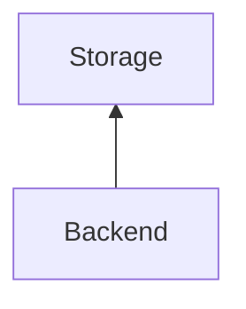
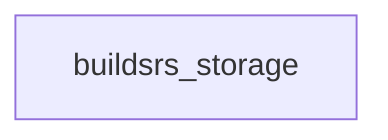

# Storage

The storage service stores artifacts that have been built. Storage is typically
handled by an S3-compatible storage provider. Currently, we are using Wasabi
for this, because they do not charge a fee for egress. Depending on
configuration, artifacts may be served directly from the storage service.

## Services

The only component that directly interacts with the storage service is the
backend. However, when clients retrieve crate artifacts, they may be served
directly from storage.

## Crates

The storage interactions are implemented in the [buildsrs_storage][] crate.

[buildsrs_storage]: /rustdoc/buildsrs_storage
