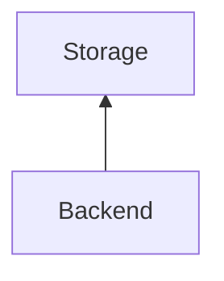
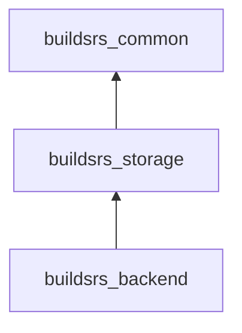

# Storage

The storage service stores artifacts that have been built. Storage is typically
handled by an S3-compatible storage provider. Currently, we are using Wasabi
for this, because they do not charge a fee for egress. Depending on
configuration, artifacts may be served directly from the storage service.

The storage interactions are implemented in the [buildsrs_storage][] crate.

## Interactions

The storage crate itself is not a component that can be deployed, it is merely
library which allows for connecting to a storage provider.

The only component that directly interacts with the storage service is the
backend. However, when clients retrieve crate artifacts, they may be served
directly from storage.

## Dependencies

## Features

| Name | Description |
| --- | --- |
| `s3` | Allows using a S3-compatible storage. |
| `filesystem` | Allows using a filesystem-backed storage. |
| `cache` | Enables an in-memory cache layer for storage assets. |
| `options` | Command-line options parser for storage. |
| `temp` | Temporary storage creation. |

By default, the `filesystem`, `s3`, `options` and `cache` features are enabled.

[buildsrs_storage]: /rustdoc/buildsrs_storage
