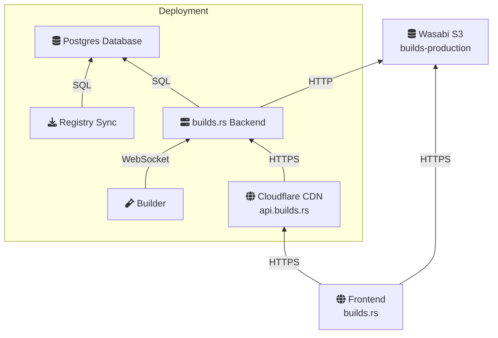

# Architecture

This guide explains the architecture of this project, both in terms of deployed
services as well as in terms of the code structure. This exists to give an overview
of how the system works as well as which component is responsible for what.

This project uses a microservice architecture, meaning that there are multiple
services that need to be deployed. This makes deploying and scaling easier. Care
is taken to avoid some of the pitfalls of a microservice architecture: services are
only split if it is absolutely necessary, to keep the amount of services that need
to be deployed to a reasonable amount. Currently, there are only two services that
need to be deployed (`backend` and `registry-sync`) for the system to work, and
and builders as needed.

Additionally, the API between services is not reimplemented in every service, but
defined once in common crates and reused. This, in addition to serde makes building
even complex communication protocols somewhat simple.

## Services

This project is deployed as a handful of containerized services. There are two
stateful components (a Postgres database and a Wasabi storage account), and the
rest of the components are stateless.

### Backend

The backend is responsible for offering two APIs: the public REST API that the
frontend uses to fetch metadata, such as which crates and versions exist and
which artifacts have been built. The second API is for the builder instances
to connect and fetch build jobs, consisting of a WebSocket and a REST API for
uploading artifacts. This component tracks the number of downloads for each crate
and periodically writes this data to the database.

### Storage

Storage is handled by Wasabi. This is an external provider that offers an
S3-compatible API at reasonable prices and no egress fees.

### Database

Uses a [Postgres][postgres] database to store metadata. The database stores a
list of crates and crate versions that is synced to the list of crates on
<crates.io> using the Registry Sync service, a list of registered Builders, a
list of current or previous jobs and a list of artifacts for every crate
version.

### Frontend

The frontend is a Rust WebAssembly application written using the [Yew][yew]
framework, this is deployed as the main website for <builds.rs>. It talks to
the backend using a REST API.

### Registry Sync

The registry sync components keeps the system in sync with the list of crates
published on <crates.io>. To do this, it polls the [crates.io index][crates.io
index] and inserts any changes into the database directly.

### Builder

The builder is a component that fetches jobs from the backend, builds them
using [Docker][docker], and pushes the resulting binaries back into the
backend. This can be replicated as needed for parallel building.

[postgres]: https://www.postgresql.org/
[crates.io index]: https://github.com/rust-lang/crates.io-index
[crates.io]: https://crates.io/
[docker]: https://docs.docker.com/engine/install/
[rustup]: https://rustup.rs/
[just]: https://github.com/casey/just
[trunk]: https://trunkrs.dev/
[wasabi]: https://wasabi.com/
