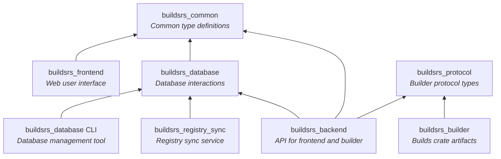

## Crates

This project is split up into multiple sub-crates to allow for an easier
development experience. The goal is to compartmentalize responsibility and to
allow for sharing code between different services. By defining APIs in terms of
shared types that can be serialized and deserialized using [serde][serde], it
becomes quite easy to build stable and robust APIs between components.

### [`buildsrs_database`][buildsrs_database]

This crate defines all interaction with the database. Services may not directly
interact with the database by any other means (sending SQL statements). This
crate includes tooling for building comprehensive unit tests for database
interactions and can detect when connecting to a database in an invalid state
(such as not properly migrated) on service launch.

This crate also includes a CLI utility that can be used for administrative
purposes, such as manually running migrations, registering Builders, setting
builder permissions and manually disabling crates or builders.

### [`buildsrs_backend`][buildsrs_backend]

This crate implements the backend, it connects to the database using the
`buildsrs_database` crate and uses the Axum crate for offering the REST and
WebSocket APIs.

### [`buildsrs_common`][buildsrs_common]

This crate contains shared types, such as API request and response types that
are used by multiple crates.

### [`buildsrs_frontend`][buildsrs_frontend]

The frontend crate defines a Rust WebAssembly application that is designed to
run in the browser and be the main frontend for <builds.rs>. This uses the
types defined in the `common` crate to communicate with the backend.

### [`buildsrs_protocol`][buildsrs_protocol]

Communication with the builder and the backend is a bit complex, because of the
need for authentication and for the need to sign artifacts electronically to
form a chain of trust that can be externally validated.

For this reason, the `protocol` crate defines the protocol in terms of types
(enums of messages that may be sent). These are unit tested.

### [`buildsrs_builder`][buildsrs_builder]

This crate defines the builder component, which can be dynamically deployed as
needed and connects to the backend to fetch jobs. It uses the
`buildsrs_protocol` crate for the types needed to send messages to the backend.

### [`buildsrs_registry_sync`][buildsrs_registry_sync]

The `buildsrs_registry_sync` crate defines the service which syncronizes the
list of published crates on the [crates.io index][] with the database.

[postgres]: https://www.postgresql.org/
[crates.io index]: https://github.com/rust-lang/crates.io-index
[crates.io]: https://crates.io/
[docker]: https://docs.docker.com/engine/install/
[rustup]: https://rustup.rs/
[just]: https://github.com/casey/just
[trunk]: https://trunkrs.dev/
[wasabi]: https://wasabi.com/

[buildsrs_database]: /rustdoc/buildsrs_database
[buildsrs_backend]: /rustdoc/buildsrs_backend
[buildsrs_frontend]: /rustdoc/buildsrs_frontend
[buildsrs_common]: /rustdoc/buildsrs_common
[buildsrs_protocol]: /rustdoc/buildsrs_protocol
[buildsrs_builder]: /rustdoc/buildsrs_builder
[buildsrs_registry_sync]: /rustdoc/buildsrs_registry_sync
