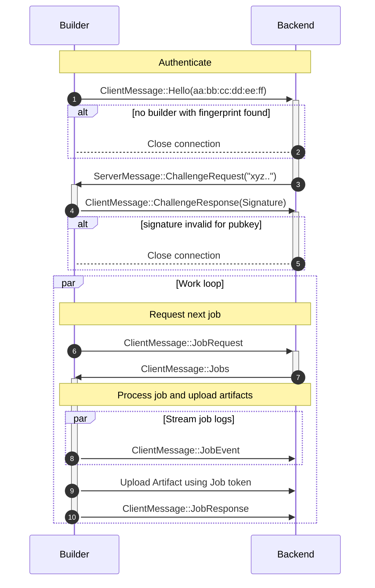

# Builder Protocol

The connection between the builder and the backend happens over a WebSocket. The
protocol that they use to communicate is defined as message enums in the Protocol
crate. This section illustrates how this protocol works on a high level.

Here is explanations for every step of this protocol:

1.  The builder uses an SSH key to authenticate with the server. Upon connecting,
    it sends the fingerprint of it's key to the backend.
2.  The backend then looks in the database to see if a builder with said
    fingerprint is known. If not, it terminates the connection.
3.  The backend generates a random byte sequence and sends it to the builder as challenge.
4.  The builder response with a message of the same bytes and a signature.
5.  The backend verifies the signature, both that it is valid and that it was
    generated by the correct public key. If the signature is invalid, the connection
    is closed.
6.  The builder requests a job from the backend.
7.  The backend response with a job description, which contains a URL to fetch the
    crate source, a hashsum of the contents, an indication of which artifact to
    generate and a job token.
8.  While running the job, the builder streams logs back to the backend.
9.  When the job is completed, the builder uploads the generated artifacts to the backend
    using the job token.
10. Finally, the builder sends a message to the backend informing it of the job completion
    and sending a signature of the completed build.
