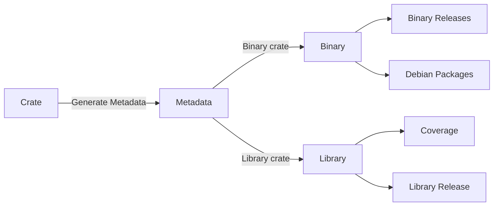

# Crates Workflow

This section describes the workflow of buildsrs, from the point where new crate
versions are known to the generation of artifacts.

Information about crates is put into the system by the Registry Sync service.
It synchronizes the crates index with the database, creating entries for crates
that are newly published. It then creates on job for every new crate, which is
to build metadata.

These jobs are picked up by the builders, which fetch the crate and generate
metadata using Cargo. This metadata, which is a JSON manifest, gets uploaded
as an artifact to the backend.

Upon receiving the manifest, the backend will parse it to record what kind of
crate this is (binary or library), and create the appropriate jobs. Depending
on what kind of crate it is, different jobs are created.

## Targets

For library crates, some possibilities are:

- Generating coverage information using `cargo llvm-cov`
- Generating library releases as cdylibs
- Generating library releases as WebAssembly

For binary crates, some possibilities are:

- Generating binary releases for different target triples
- Generating Debian packages using `cargo deb`
- Generating Web Applications using `trunk build`
